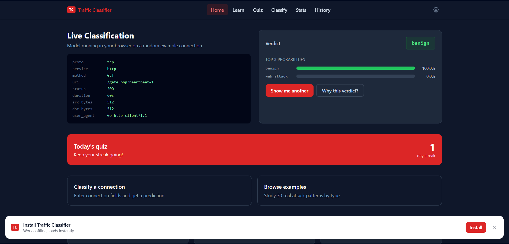
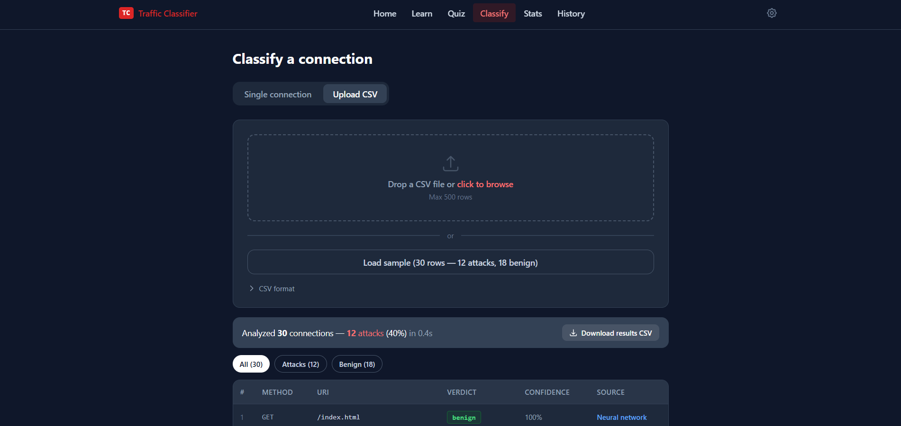
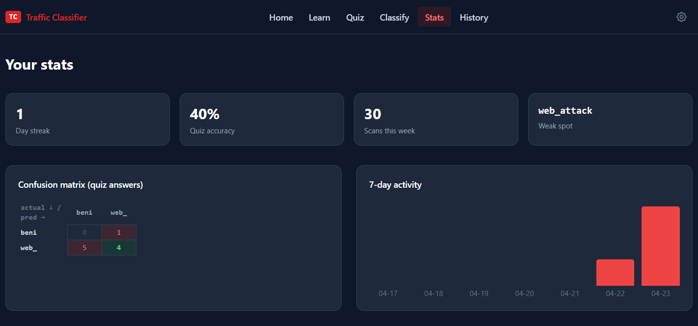
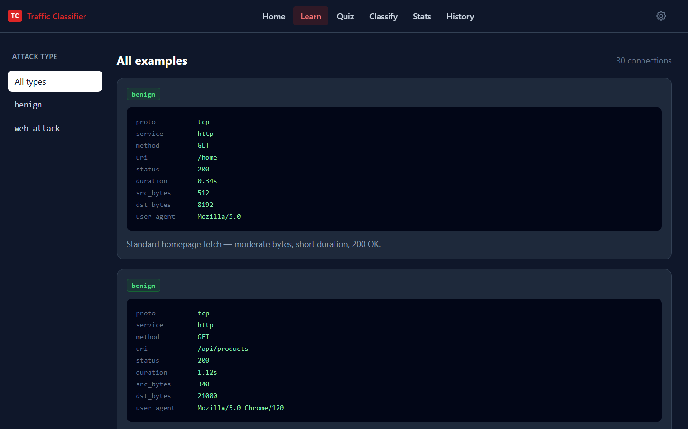
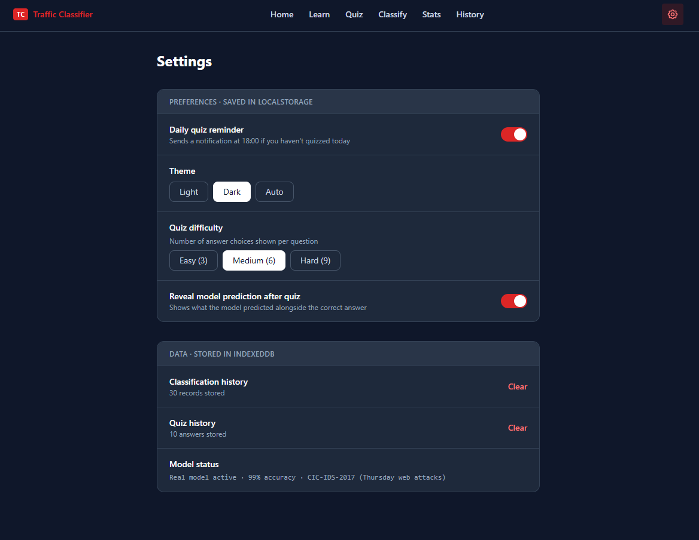
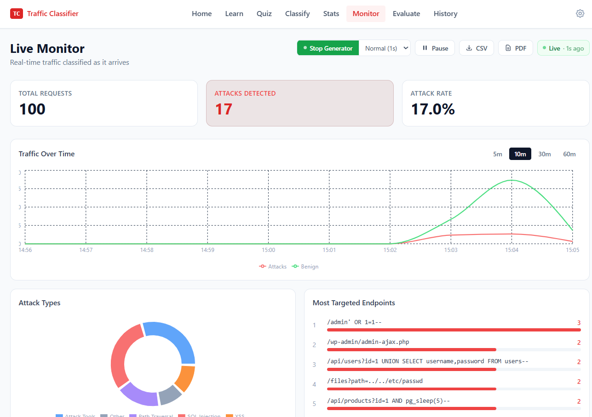
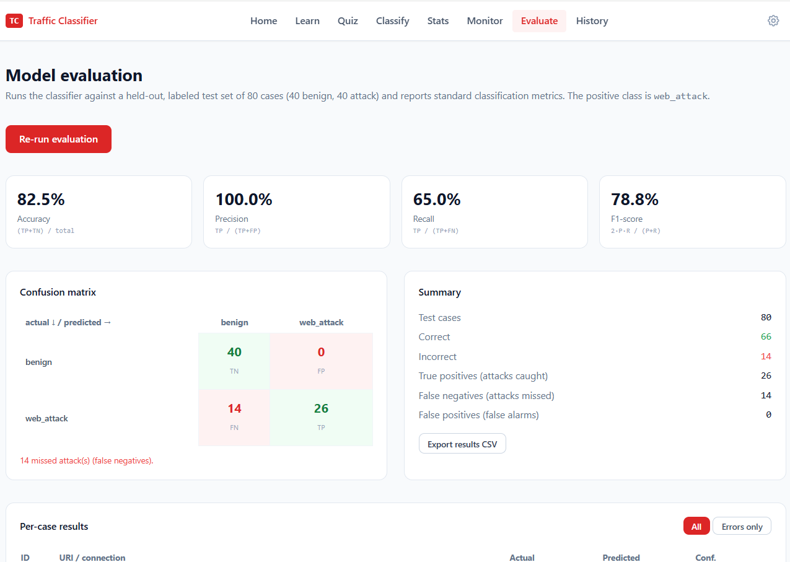

# Traffic Classifier PWA


**Live demo → [traffic-classifier-pwa.vercel.app](https://traffic-classifier-pwa.vercel.app)**

A Progressive Web App that classifies network traffic connections as **benign** or **web attack** using a real neural network trained on the CIC-IDS-2017 dataset. Built for a master's course in Advanced Web Applications.

The classifier runs **in the browser** (offline-capable) with inference moved to a **Web Worker** so the UI never blocks. An optional **Node + Supabase backend** streams live traffic to a real-time monitoring dashboard, and a built-in **evaluation page** measures the model's precision/recall/F1 against a held-out test set.

---

## Demo

▶️ [Watch demo video (1:49)](https://drive.google.com/file/d/1ugJQb8SRABy7AkzHLy4hjh1VotJDh5xG/view?usp=sharing)

[Live app](https://traffic-classifier-pwa.vercel.app) | [GitHub](https://github.com/ajshehasan/traffic-classifier-pwa)

---

## Screenshots



<table>
  <tr>
    <td><br/><sub><b>CSV batch classification</b></sub></td>
    <td><br/><sub><b>Stats — confusion matrix &amp; 7-day activity</b></sub></td>
  </tr>
  <tr>
    <td><br/><sub><b>Learn — browse attack examples</b></sub></td>
    <td><br/><sub><b>Settings — preferences &amp; model status</b></sub></td>
  </tr>
  <tr>
    <td><br/><sub><b>Live Monitor — real-time classified traffic (Supabase Realtime)</b></sub></td>
    <td><br/><sub><b>Evaluate — confusion matrix &amp; precision/recall/F1</b></sub></td>
  </tr>
</table>

---

## Tech stack

| Layer | Technology |
|---|---|
| UI | React 18 + TypeScript + Tailwind CSS |
| Build & PWA | Vite 8 + vite-plugin-pwa (Workbox), route-based code-splitting |
| ML inference | TensorFlow.js running in a **Web Worker** (off the main thread) |
| Backend (demo) | Node.js log generator + **Supabase** (Postgres + Realtime) |
| Persistence | IndexedDB via `idb` + `localStorage` |
| Routing | React Router v6 (lazy-loaded routes) |

---

## Quick start

```bash
cd frontend
npm install
npm run dev        # dev server → http://localhost:5173
npm run build      # production build + service worker in dist/
npm run preview    # preview the production build locally
```

---

## Course requirements

### 1. Progressive Web App (PWA)

- Installable via the browser address bar install button
- Manifest at `/manifest.webmanifest` — name, icons, theme colour, standalone display
- Icons at `frontend/public/pwa-192x192.png` and `frontend/public/pwa-512x512.png`
- Config: [`vite.config.ts`](frontend/vite.config.ts) — `VitePWA` plugin with `registerType: 'autoUpdate'`

### 2. Service worker (offline-first)

- Auto-generated by Workbox via `vite-plugin-pwa`
- Pre-caches the full app shell (all JS/CSS/HTML chunks) and the model files (`model.json`, `group1-shard1of1.bin`)
- After the first load, the app works with no network connection
- `workbox.maximumFileSizeToCacheInBytes` set to 10 MB to accommodate model weights
- To test: DevTools → Network → check **Offline**, then reload — app still works

### 3. Push notifications

- **Not** requested on first load — triggered only when the user enables the toggle in Settings
- Permission is requested via `Notification.requestPermission()` in [`notifications.ts`](frontend/src/notifications.ts)
- On permission grant, a reminder is scheduled for 18:00 via `registration.showNotification()`
- Completing a classification or quiz fires an immediate local notification
- To test manually: DevTools → Application → Service Workers → **Push** (send empty payload)

### 4. Local storage — two kinds

| Kind                  | Purpose                                | Key/Store                                                                                                | File                                |
| --------------------- | -------------------------------------- | -------------------------------------------------------------------------------------------------------- | ----------------------------------- |
| `localStorage`        | User preferences that never grow large | `notificationsEnabled`, `theme`, `quizDifficulty`, `revealModelPrediction`, `streakDays`, `lastQuizDate` | [`prefs.ts`](frontend/src/prefs.ts) |
| IndexedDB (via `idb`) | Structured data that grows over time   | `classifications` store, `quiz_answers` store                                                            | [`db.ts`](frontend/src/db.ts)       |

To verify in DevTools: **Application → Storage → Local Storage** and **Application → IndexedDB → traffic-classifier**

### 5. Performance & advanced web techniques

- **Web Worker inference** — the neural network runs in a background thread ([`model.worker.ts`](frontend/src/model.worker.ts)), keeping the main thread free so the UI never freezes during classification or the live traffic stream
- **Route-based code-splitting** — each page is a lazy-loaded chunk (`React.lazy` + `Suspense`), so only the visited page's code is downloaded
- **On-demand library loading** — heavy libraries (jsPDF for report export) are dynamically imported only when used
- **Real-time data** — Supabase Realtime (WebSocket) subscription drives the live Monitor page
- Verify in DevTools → **Network**: TF.js loads as a separate worker chunk; page chunks load only on navigation

---

## The model

- **Architecture:** MLP — `Dense(128, relu) → Dropout(0.3) → Dense(64, relu) → Dropout(0.2) → Dense(n_classes, softmax)`
- **Dataset:** CIC-IDS-2017 (Thursday morning web attacks)
- **Classes (multi-class):** `BENIGN` / `Web Attack - Brute Force` / `Web Attack - XSS` (SQL Injection has too few samples to train reliably and is dropped)
- **Test accuracy:** 97.66%
- **Input:** 78 normalized features derived from `ConnectionFeatures` (flow duration, byte counts, packet stats, TCP flags, IAT values, etc.)
- **Files:** `frontend/public/model/model.json`, `frontend/public/model/group1-shard1of1.bin`, `frontend/public/model/preprocessing.json`

The model is **multi-class** — it predicts the specific attack type, not just attack-vs-benign. The app reads the class list from `preprocessing.json` and is data-driven, so it adapts to however many classes the notebook produces. The Classify page shows the predicted class (e.g. `Web Attack - XSS`) and the full probability distribution; the binary attack-vs-benign verdict used elsewhere is derived as `P(attack) = 1 − P(BENIGN)`.

Inference runs in a dedicated **Web Worker** ([`model.worker.ts`](frontend/src/model.worker.ts)), so TensorFlow.js and the neural-network forward pass never execute on the main thread — the UI stays responsive even while classifying the live traffic stream. The public API ([`model.ts`](frontend/src/model.ts)) is a thin message-passing proxy; the classification logic itself ([`classifierShared.ts`](frontend/src/classifierShared.ts)) is shared between the worker and the fallback so behaviour is identical. TF.js (~1.6 MB) is bundled into the worker chunk and kept out of the main-thread bundle entirely.

The model loads in the background on first visit and is then available offline via the service worker cache. If model files are missing (e.g. first offline visit before SW caches them), the app silently falls back to a rule-based classifier.

Training notebook: [Open in Colab](https://colab.research.google.com/drive/1tBWgAYJKK4dNM7903fb0f2fo0FoSJh5s?usp=sharing)

---

## App pages

| Route       | Description                                                         |
| ----------- | ------------------------------------------------------------------- |
| `/`         | Live prediction on a random example; streak banner; stat mini-cards |
| `/learn`    | Browse all 30 examples grouped by class (benign / web_attack)       |
| `/quiz`     | 10-question practice — answer, then see the model's prediction      |
| `/classify` | Single connection form **or** CSV batch upload (see below)          |
| `/stats`    | Confusion matrix, 7-day activity chart, accuracy and streak         |
| `/monitor`  | Real-time traffic monitor powered by Supabase Realtime              |
| `/evaluate` | Model evaluation — confusion matrix + precision/recall/F1 on a held-out test set |
| `/history`  | Paginated table of all past classifications and quiz answers        |
| `/settings` | localStorage preferences + IndexedDB data management                |

---

### Live Traffic Monitoring

Real-time traffic monitoring dashboard powered by Supabase Realtime. Shows
incoming connections classified as they arrive, with stats on attack rate
and filtering by verdict type. Backend log generator simulates realistic
web traffic for demonstration.

```bash
# In a separate terminal — run while the PWA is open
cd backend
cp .env.example .env     # then fill in your Supabase URL + anon key
npm install
npm start                # inserts a new log every 500 ms
```

Supabase credentials are read from environment variables (`backend/.env`, git-ignored); see [`backend/README.md`](backend/README.md). The monitor page subscribes to `INSERT` events on the `live_logs` Supabase table and classifies each new row through the same rule-layer → neural-network → hybrid pipeline used everywhere else in the app.

> **Note:** the live monitor requires an active Supabase project. Free-tier projects pause after 7 days of inactivity — running the generator counts as activity and keeps it awake.

---

## Model evaluation

The **Evaluate** page (`/evaluate`) measures real model performance by running the classifier over a balanced, held-out test set of 80 labeled cases ([`evalDataset.ts`](frontend/src/data/evalDataset.ts) — 40 benign, 40 attack), kept separate from the Learn/Quiz examples. It reports the standard classification metrics and a confusion matrix, with a per-case results table and CSV export.

The positive class is `web_attack`, so:

- **Precision** = of the connections flagged as attacks, how many really were (low false-alarm rate)
- **Recall** = of all real attacks, how many were caught (low miss rate)
- **F1** = harmonic mean of the two

Because the app derives only ~30 of the 78 CIC-IDS features from 9 user-supplied fields (the rest are zeroed), this in-app evaluation is a deliberately **stricter, real-world test** than the notebook's 97.66% accuracy on the full CIC feature set — making it a more honest measure of how the deployed classifier behaves on the connection data it actually receives.

---

## CSV batch classification

Upload a CSV of connections to classify in bulk from the **Classify** page → **Upload CSV** tab.

A sample file at [`/examples/sample-traffic.csv`](frontend/public/examples/sample-traffic.csv) demonstrates the expected format (30 rows — 18 benign, 12 attacks across SQL injection, XSS, path traversal, command injection, and attack-tool user-agents).

**Expected columns** (header row required):

| Column | Required | Example |
|---|---|---|
| `proto` | ✓ | `tcp` / `udp` / `icmp` |
| `service` | ✓ | `http` / `ssl` / `dns` |
| `duration` | ✓ | `0.45` |
| `src_bytes` | ✓ | `1024` |
| `dst_bytes` | ✓ | `32768` |
| `http_method` | optional | `GET` |
| `http_uri` | optional | `/api/login` |
| `http_status_code` | optional | `200` |
| `http_user_agent` | optional | `Mozilla/5.0 …` |

Each row is processed through the full **rule-layer → neural-network → hybrid** pipeline. Results are shown in a filterable table (All / Attacks / Benign) with per-row classifier source labels (Rule / Neural network / Hybrid), and saved to IndexedDB grouped by `batch_id` so they appear in History under the **Batch** filter.

Processing is capped at 500 rows for in-browser performance. Export the annotated results via **Download results CSV**.

---

## Feature mapping (ConnectionFeatures → CIC-IDS-2017)

The app collects 9 connection fields from the user. From these, ~30 of the 78 CIC features are derived:

| CIC feature                     | Derived from                              |
| ------------------------------- | ----------------------------------------- |
| Flow Duration                   | `duration × 1 000 000` (µs)               |
| Total Length of Fwd/Bwd Packets | `src_bytes` / `dst_bytes`                 |
| Fwd/Bwd Packet Length Mean      | bytes ÷ estimated packet count (MTU 1500) |
| Flow Bytes/s, Flow Packets/s    | bytes and packets ÷ duration              |
| Down/Up Ratio                   | `dst_bytes / src_bytes`                   |
| TCP flags (SYN, ACK, PSH, FIN)  | inferred from `proto = 'tcp'`             |
| Destination Port                | `service` → 80 / 443 / 21 / 53            |
| Init_Win_bytes                  | 65535 for TCP connections                 |
| IAT estimates                   | duration ÷ (packets − 1)                  |
| Remaining 48 features           | zeroed (normalise to training mean)       |

---

## Project structure

```
traffic-classifier-pwa/
├── frontend/
│   ├── src/
│   │   ├── model.ts            classifier API — proxy to the inference Web Worker
│   │   ├── model.worker.ts     Web Worker: TF.js model load + inference
│   │   ├── classifierShared.ts shared logic (feature vector, rules, fallback)
│   │   ├── supabase.ts         Supabase client (env-configured)
│   │   ├── types.ts            AttackClass, ConnectionFeatures, Prediction
│   │   ├── db.ts               IndexedDB wrapper (idb)
│   │   ├── prefs.ts            localStorage wrapper
│   │   ├── notifications.ts    permission + reminder scheduling
│   │   ├── data/examples.ts    hand-curated labelled connections (Learn/Quiz)
│   │   ├── data/evalDataset.ts held-out 80-case test set (Evaluate page)
│   │   ├── components/         Header, VerdictChip, ProbabilityBars, ConnectionCard
│   │   └── pages/              Home, Learn, Quiz, Classify, Stats, Monitor, Evaluate, History, Settings
│   ├── public/
│   │   └── model/              trained TF.js model files
│   └── vite.config.ts
├── backend/                    Node + Supabase live-traffic log generator
│   ├── log-generator.js
│   ├── .env.example
│   └── README.md
├── ml/
│   └── web_attack_detection.ipynb   training notebook (CIC-IDS-2017)
├── README.md
└── LICENSE
```
